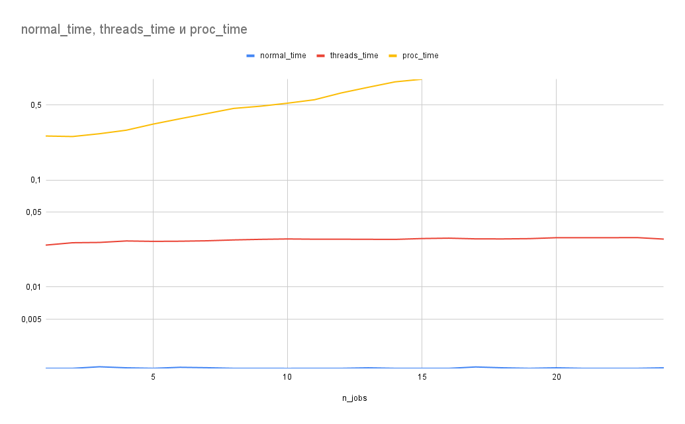
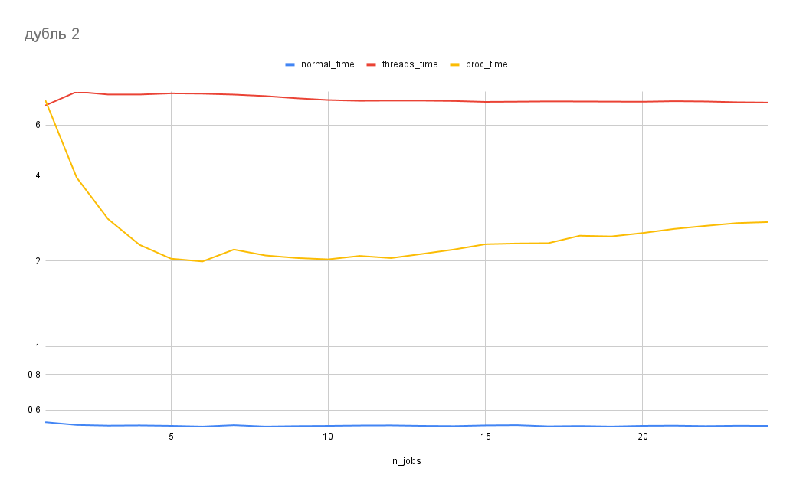

# Medium

Во-первых, я проверил, действительно получается `1` в результате :)

Во-вторых, лучше всего полученные данные представить графиком:

Произошел бред, потому что я замерил среднее по 50 попыткам. Создавать 50 потоков каждый раз - это смертельно долго для одного `for`-а по 10000 элементам (а я поставил `n_iter=10000`, потому что иначе слишком быстро).

Будем замерять только один запуск, но тогда он должен быть достаточно долгим. Выкрутим `n_iter` до `3e6`:

Процессы, как и следовало ожидать, работают быстрее с ростом `n_jobs`, а потом кончаются физические ядра и растет только оверхед. Но вот чего я не могу понять, это почему однопоточное исполнение работает так быстро (по сравнению с многопоточным исполнением).
